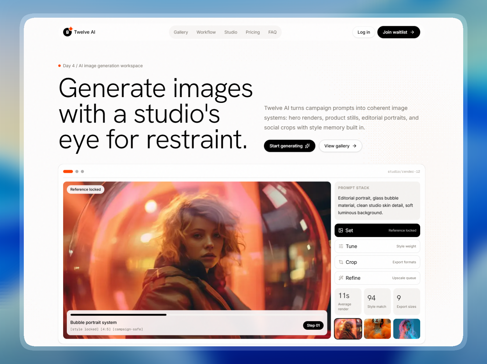

# 🚀 Twelve AI Landing Page
> **Day 4/30 of the "Building 1 AI-Generated Landing Page Every Day" Challenge**



## 🚀 About

Conceptual landing page for **Twelve AI**, an **AI image generation workspace for creative teams**, developed with **Next.js 16**, **TypeScript**, and **Tailwind CSS 4**. This project is the fourth realization of an ambitious challenge: creating **1 complete and functional mockup per day using AI**.

Twelve AI is designed for creative teams producing high-volume visual systems. The goal is to instantly convey **precision**, **taste**, **speed**, and **production-grade creative control** through a modern, minimal, high-end aesthetic.

Live URL: [https://twelve-ai-landing.adrielzimbril.com](https://twelve-ai-landing.adrielzimbril.com)

## 🎨 Design & Aesthetic Decisions (The "Why")

For this fourth day, the chosen theme revolves around **AI image generation, art direction, campaign production, and visual systems**.

- **Minimal Premium Surface:** The interface relies on an eggshell background (`#fdfcfc`), obsidian typography, restrained hairline cards, and generous whitespace to feel editorial, calm, and expensive.
- **Image-Led Product Signal:** Real visual outputs are placed directly in the hero, gallery, and creation flows so the product promise is visible immediately instead of being described abstractly.
- **Purposeful Interaction:** Interactive cards simulate image creation workflows, prompt refinement, render stages, approval signals, and dashboard decisions. Motion supports the product story instead of animating text for decoration.
- **High-End Production Rhythm:** The layout uses a floating navigation, bento-style studio panels, gallery pacing, compact badges, and a modern footer to communicate a polished SaaS tool made for repeated creative work.
- **AI Brand Mark:** The favicon and site logo use a compact AI document mark with a signal spark, tying the brand identity to generated image systems and production review flows.

## 🧩 Key Sections

- **🌟 Hero Header:** Designed to grab attention in the first 3 seconds with large Hanken Grotesk typography, a floating navigation, a WebGL pixel ambience, and an interactive image slider that cycles through creation states and visual references.
- **🖼️ Output Gallery:** A responsive gallery of vivid AI-style imagery showing campaign portraits, fantasy concepts, color studies, studio scenes, and landscape directions.
- **🧠 Interactive Studio Bento:** Simulates a production dashboard with selectable flows, render stages, variants, approvals, prompt controls, and reporting cards built around useful interaction.
- **💳 Pricing System:** Three production-oriented plans with a highlighted primary tier, clean CTA spacing, and a premium high-contrast card treatment.
- **🏢 Modern Footer:** A restrained brand close with contact routes, product links, social proof language, and a polished final conversion area.

## 🛠️ Tech Stack

This mockup was built with cutting-edge technologies from the React ecosystem:

- **[Next.js 16](https://nextjs.org/)** (App Router)
- **[React 19](https://react.dev/)**
- **TypeScript** for scalable component architecture and safer iteration.
- **[Tailwind CSS v4](https://tailwindcss.com/)** for design tokens, utilities, and modern CSS support.
- **Three.js, OGL & Postprocessing** for the ambient Pixel Blast visual layer.
- **[Lucide React](https://lucide.dev/)** for clean, consistent iconography.
- **Next Font** with **Hanken Grotesk** for display typography and optimized self-hosted font loading.

## 🚀 Quick Start

```bash
# Install dependencies
pnpm install

# Run development server
pnpm dev
```

Open [http://localhost:3000](http://localhost:3000) in your browser to see the result.

## 🌌 Let's meet in space (or on Earth) 🚀

I'm always happy to discuss new projects, collaborations, or simply exchange creative ideas. Here's how to contact me:

- **📧 Email**: [hello@adrielzimbril.com](mailto:hello@adrielzimbril.com)
- **🌐 Website**: [https://www.adrielzimbril.com](https://www.adrielzimbril.com)
- **🐦 Twitter**: [https://twitter.com/adrielzimbril](https://twitter.com/adrielzimbril)
- **💼 LinkedIn**: [https://www.linkedin.com/in/adrielzimbrilcode](https://www.linkedin.com/in/adrielzimbrilcode)
- **🐼 GitHub**: [https://github.com/adrielzimbril](https://github.com/adrielzimbril)

### 🐼 Fun Facts

- 🚀 Passionate about space exploration and technology
- 🐼 Love pandas (and animals in general!)
- 🎨 Creative at heart, whether in design or code
- ☕ Addicted to coffee and complex technical challenges

## 🌟 Join the Adventure

If you like this project, feel free to:

- ⭐ Star the project
- 🐞 Report bugs
- ✨ Suggest improvements
- 🚀 Share with other enthusiasts

## 💖 Support the Project

If you find this project useful and would like to support its development, you can do so through these platforms:

[](https://go.adrielzimbril.com/gs)

## 🌐 Hosting

This project is 100% hosted on modern cloud infrastructure for maximum performance and reliability:

[](https://vercel.com)

## 📄 License

This project is under the MIT license. Feel free to use it as a base for your own portfolio or project.

---

**Developed with ❤️ by Adriel Zimbril**  
_Product Designer & Fullstack Developer_  
🚀 Digital Universe Explorer | 🐼 Panda Friend | 🎨 Passionate Creator
